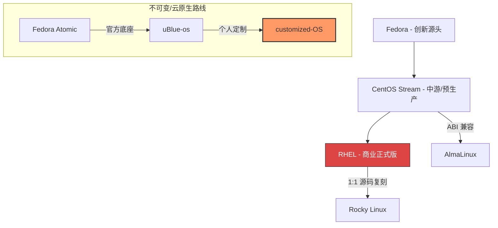

```mermaid
graph TD
    %% 传统路线
    A[Fedora - 创新源头] --> B[CentOS Stream - 中游/预生产]
    B --> C[RHEL - 商业正式版]
    B -- ABI 兼容 --> D[AlmaLinux]
    C -- 1:1 源码复刻 --> E[Rocky Linux]

    %% 不可变路线
    subgraph Atomic_Line [不可变/云原生路线]
        F[Fedora Atomic] -- 官方底座 --> G[uBlue-os]
        G -- 个人定制 --> H[customized-OS]
    end

    %% 样式美化
    style H fill:#f96,stroke:#333,stroke-width:2px
    style C fill:#d44,stroke:#333,color:#fff
```
